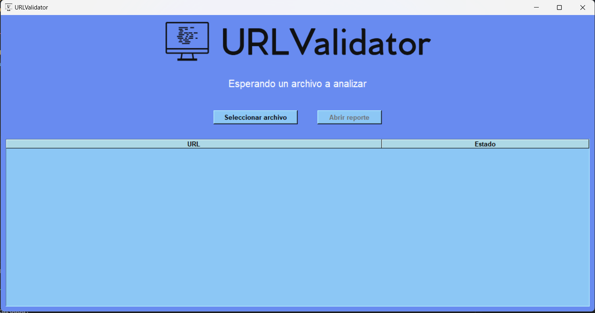
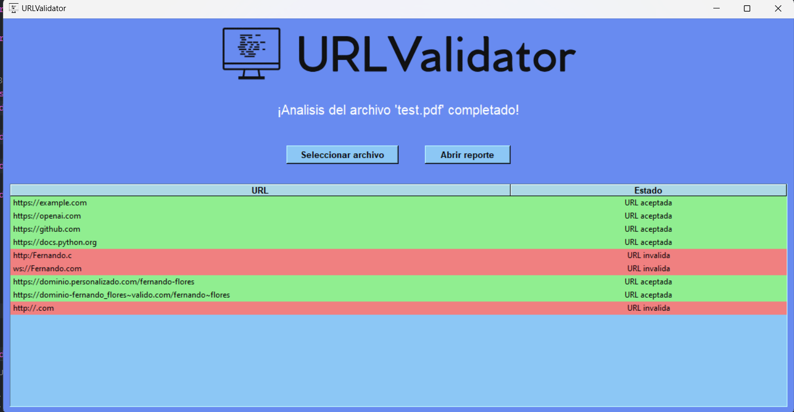
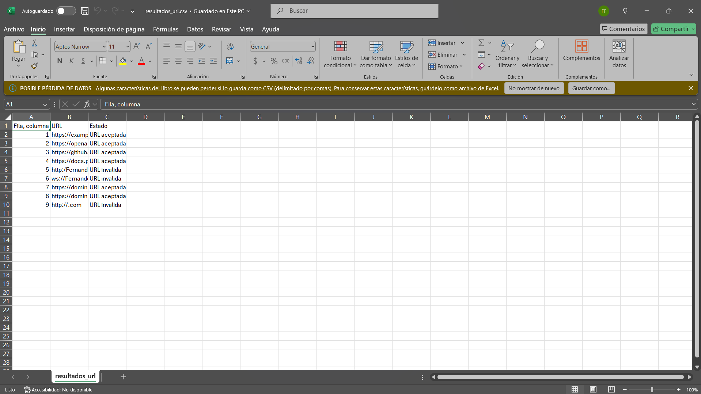

# URL Validator

## Descripción
**URL Validator** es una herramienta que permite validar URLs extraídas de diferentes tipos de archivos, incluyendo Excel, Word, PDF y archivos HTML. Este proyecto cuenta con una interfaz gráfica  desarrollada con **Tkinter**.





## Desarrolladores
Este proyecto fue desarrollado por:

- **Fernando Emiliano Flores De La Riva** - **223251**
- **Diego Eduardo Bejar Zea** - **223268**

## Requisitos

Antes de ejecutar el proyecto, asegúrate de tener instalado **Python** en tu sistema. Luego, necesitarás instalar las siguientes bibliotecas:

```bash
pip install pandas python-docx beautifulsoup4 pdfplumber tk
